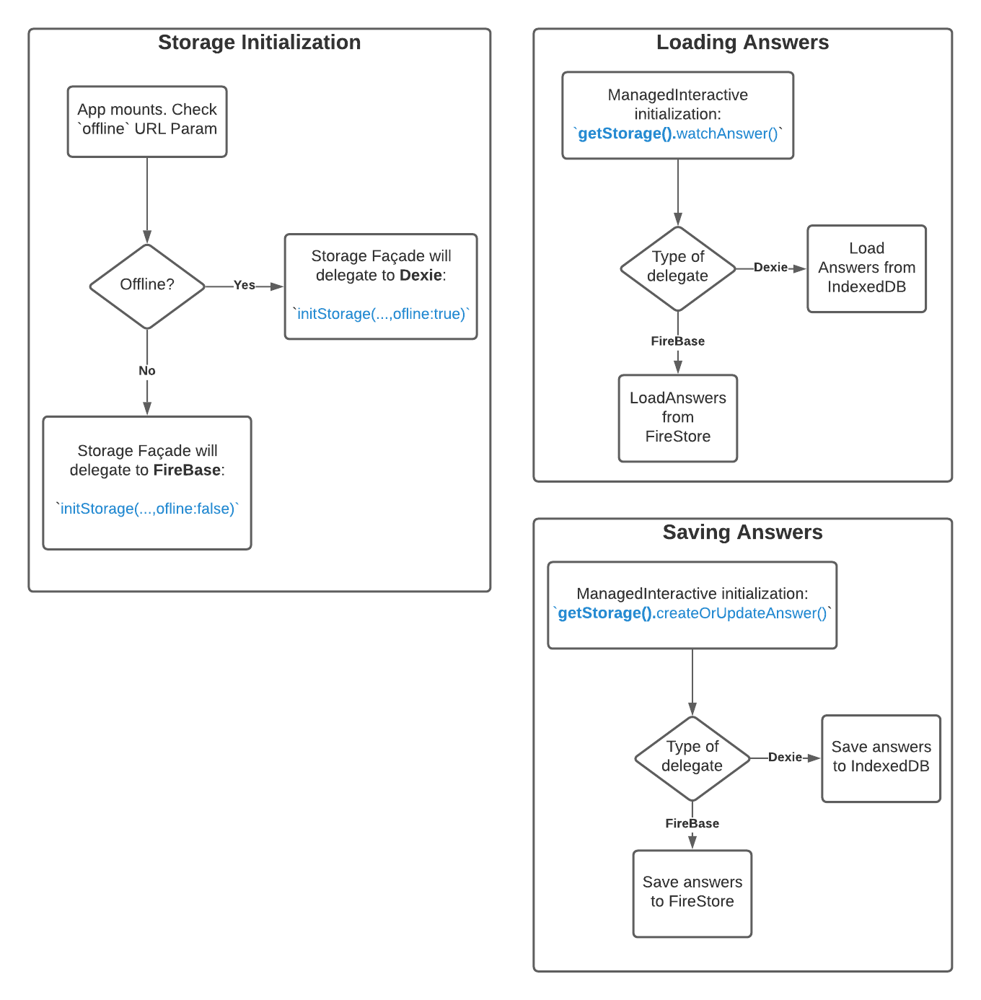

# Storage Façade for saving student work.
The `storage-facade.ts` file presents a single interface to two different storage
backends for saving student data. Depending on whether or not the student is
working **`offline`** methods on this singleton class will delegate storage
functions to one of `FireStoreStorageProvider` or `DexieStorageProvider`.



## The Storage API defined by `IStorageInterface`:

```typescript
  export interface IStorageInterface {
    setPortalData: (_portalData: IPortalData | IAnonymousPortalData) => void,
    initializeDB: (initializer: IDBInitializer) => Promise<void>,
    // initializeAnonymousDB?: (preview: boolean) => Promise<firebase.firestore.Firestore>
    // signInWithToken?: (rawFirestoreJWT: string) => Promise<firebase.auth.UserCredential>,

    getPortalData: () => IPortalData | IAnonymousPortalData | null,

    // These are directly related to storing student answers and fetching them back
    watchAnswer(embeddableRefId: string, callback: (wrappedAnswer: IWrappedDBAnswer | null) => void): () => void
    watchAllAnswers: (callback: (wrappedAnswer: IWrappedDBAnswer[]) => void) => void,
    createOrUpdateAnswer: (answer: IExportableAnswerMetadata) => void,
    getLearnerPluginStateDocId: (pluginId: number) => string|undefined,
    getCachedLearnerPluginState: (pluginId: number) => string|null,
    getLearnerPluginState: (pluginId: number) => Promise<string|null>,
    setLearnerPluginState: (pluginId: number, state: string) => Promise<string>,
    // checkIfOnline: () => Promise<boolean>,

    // for saving a whole activity to JSON
    exportActivityToJSON: (activityId?: string) => Promise<ExportableActivity>,
    importStudentAnswersFromJSONFile: (studentAnswers: string, filename: string) => boolean,
    canSyncData(): boolean,
    syncData(): void
  }
```

## Initialization:
Call the storage initializer `Storage.initStorage` with a few parameters.
The `offline` parameter is the one which will switch between FireSTore and Dexie Storage providers:

```typescript
  Storage.initStorage(name: FirebaseImp.FirebaseAppName, preview: boolean, offline: boolean);
```

## Use:
Obtain a reference to the storage provider by calling `Storage.getStorage()`.

## Link to Lucid Chart Diagram:
https://lucid.app/lucidchart/6d68f2a7-ae09-4ba1-9cea-b0a251cf43bd/edit?page=0_0#